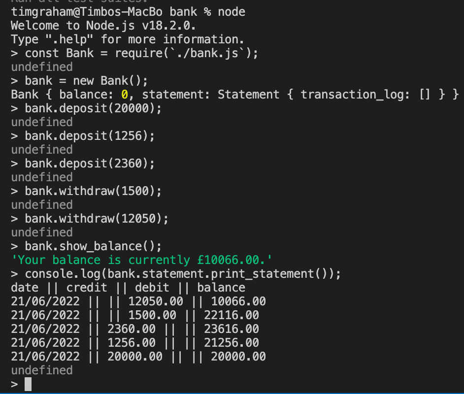

# Bank tech test

### **Requirements**

- You should be able to interact with your code via a REPL like IRB or Node. (You don't need to implement a command line interface that takes input from STDIN.)
- Deposits, withdrawal.
- Account statement (date, amount, balance) printing.
- Data can be kept in memory (it doesn't need to be stored to a database or anything).

### **Acceptance criteria**

[x] **Given** a client makes a deposit of 1000 on 10-01-2023

[x] **And** a deposit of 2000 on 13-01-2023

[x] **And** a withdrawal of 500 on 14-01-2023

[x] **When** she prints her bank statement

[x] **Then** she would see

```
date || credit || debit || balance
14/01/2023 || || 500.00 || 2500.00
13/01/2023 || 2000.00 || || 3000.00
10/01/2023 || 1000.00 || || 1000.00
```

## **Approach**

I planned out the inputs and outputs for the bank programme, and made note of any particular requirements (for example logging the
date of a transaction, and being able to print the statement in reverse order).

I split the fucntionality into banking functionality; i.e. keeping a balance, showing the balance, making deposits and withdrawals,
and statement functionality. These are my two classes.

Starting with the simplest features, i.e. showing a balance and making a deposit and withdrawal, I test drove the implementation of
the required features. 

To reduce complexity in printing the statement as instructed, the deposit and withdraw functions change the balance and log the
transaction on the transaction_log in the correct format.

## **Instructions**

- In node, require bank.js with const Bank = require(`./bank.js`)
- Create a new instance of Bank to work with.
- You can make deposits or withdrawls with the deposit() and withdraw methods, passing the value as an argument. 
- bank.print_statement() will return a list of all transactions in reverse chronological order, formatted under a header. 
- You can also use the show_balance() method to simply return the current balance of the account. 

## **Dependencies**

- There are no dependencies required to run the code in bank.js, other than those which are already required in the files.

## **Testing/linting**

- Run the testing suite with jest
- Run eslint with eslint [file] to view any linting issues.

## **Example of programme running in node**
-------------------

